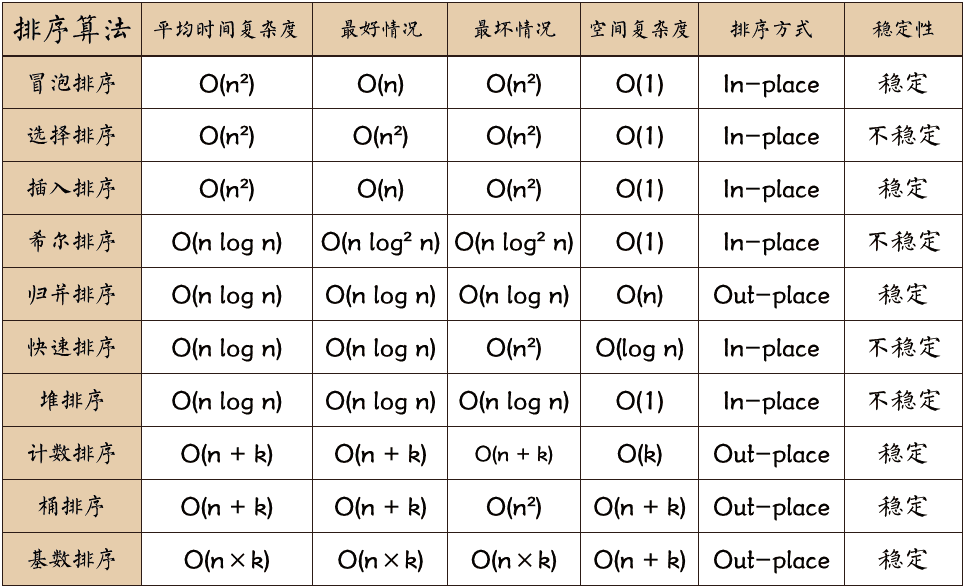

# 排序算法的分类  
  
**比较类排序：** 通过比较来决定元素间的相对次序，由于其时间复杂度不能突破O(nlogn)，因此也称为非线性时间比较类排序。  
**非比较类排序：** 不通过比较来决定元素间的相对次序，它可以突破基于比较排序的时间下界，以线性时间运行，因此也称为线性时间非比较类排序。
#  常见的排序算法
## 冒泡排序
### 算法思想
● 比较相邻的元素。如果第一个比第二个大，就交换他们两个。  
● 对每一对相邻元素作同样的工作，从开始第一对到结尾的最后一对。这步做完后，最后的元素会是最大的数。  
● 针对所有的元素重复以上的步骤，除了最后一个。  
● 持续每次对越来越少的元素重复上面的步骤，直到没有任何一对数字需要比较。  
### 代码
```javascript
function bubbleSort(arr) {
    var len = arr.length;
    for (var i = 0; i < len - 1; i++) {
        for (var j = 0; j < len - 1 - i; j++) {
            if (arr[j] > arr[j+1]) { // 相邻元素两两对比
                var temp = arr[j+1];  // 元素交换
                arr[j+1] = arr[j];
                arr[j] = temp;
            }
        }
    }
    return arr;
}
console.log(bubbleSort([4, 2, 1,3, 5, 9,10]))
```
## 快速排序
### 算法思想  
● 从数列中挑出一个元素，称为 "基准"（pivot）;  
● 重新排序数列，所有元素比基准值小的摆放在基准前面，所有元素比基准值大的摆在基准的后面（相同的数可以到任一边） 。在这个分区退出之后，该基准就处于数列的中间位置。这个称为分区（partition）操作；  
● 递归地（recursive）把小于基准值元素的子数列和大于基准值元素的子数列排序；  
### 代码
```javascript
function quickSort(arr){
  if(arr.length <= 1) return arr
  let pivotIndex = Math.floor(arr.length / 2);
  let pivot = arr.splice(pivotIndex,1)[0];
  let left = [];
  let right = [];
  for(let i = 0; i < arr.length;i++){
    if(arr[i] < pivot){
      left.push(arr[i])
    }else{
      right.push(arr[i])
    }
  }
  return quickSort(left).concat([pivot],quickSort(right))
}
console.log(quickSort([4, 2, 1,3, 5, 9,10]))

```
## 选择排序
### 算法思想  
● 首先在未排序序列中找到最小（大）元素，存放到排序序列的起始位置。  
● 再从剩余未排序元素中继续寻找最小（大）元素，然后放到已排序序列的末尾。  
● 重复第二步，直到所有元素均排序完毕。  
### 代码
```javascript
function selectionSort(arr) {
    var len = arr.length;
    var minIndex, temp;
    for (var i = 0; i < len - 1; i++) {
        minIndex = i;
        for (var j = i + 1; j < len; j++) {
            if (arr[j] < arr[minIndex]) {     // 寻找最小的数
                minIndex = j;                 // 将最小数的索引保存
            }
        }
        temp = arr[i];
        arr[i] = arr[minIndex];
        arr[minIndex] = temp;
    }
    return arr;
}

```

## 插入排序
### 算法思想  
● 从第二个数开始往前比  
● 比他大就往后排  
● 以此类推进行到最后一个数  
### 代码
```javascript
function insertionSort(arr) {
    var len = arr.length;
    var preIndex, current;
    for (var i = 1; i < len; i++) {
        preIndex = i - 1;
        current = arr[i];
        while(preIndex >= 0 && arr[preIndex] > current) {
            arr[preIndex+1] = arr[preIndex];
            preIndex--;
        }
        arr[preIndex+1] = current;
    }
    return arr;
}
```

## 归并排序
### 算法思想
● 申请空间，使其大小为两个已经排序序列之和，该空间用来存放合并后的序列；  
● 设定两个指针，最初位置分别为两个已经排序序列的起始位置；  
● 比较两个指针所指向的元素，选择相对小的元素放入到合并空间，并移动指针到下一位置；  
● 重复步骤 3 直到某一指针达到序列尾；  
● 将另一序列剩下的所有元素直接复制到合并序列尾。
### 代码
```javascript
function mergeSort(arr) {  // 采用自上而下的递归方法
    var len = arr.length;
    if(len < 2) {
        return arr;
    }
    var middle = Math.floor(len / 2),
        left = arr.slice(0, middle),
        right = arr.slice(middle);
    return merge(mergeSort(left), mergeSort(right));
}

function merge(left, right)
{
    var result = [];

    while (left.length && right.length) {
        if (left[0] <= right[0]) {
            result.push(left.shift());
        } else {
            result.push(right.shift());
        }
    }

    while (left.length)
        result.push(left.shift());

    while (right.length)
        result.push(right.shift());

    return result;
}
```
## 复杂度及稳定性

  
